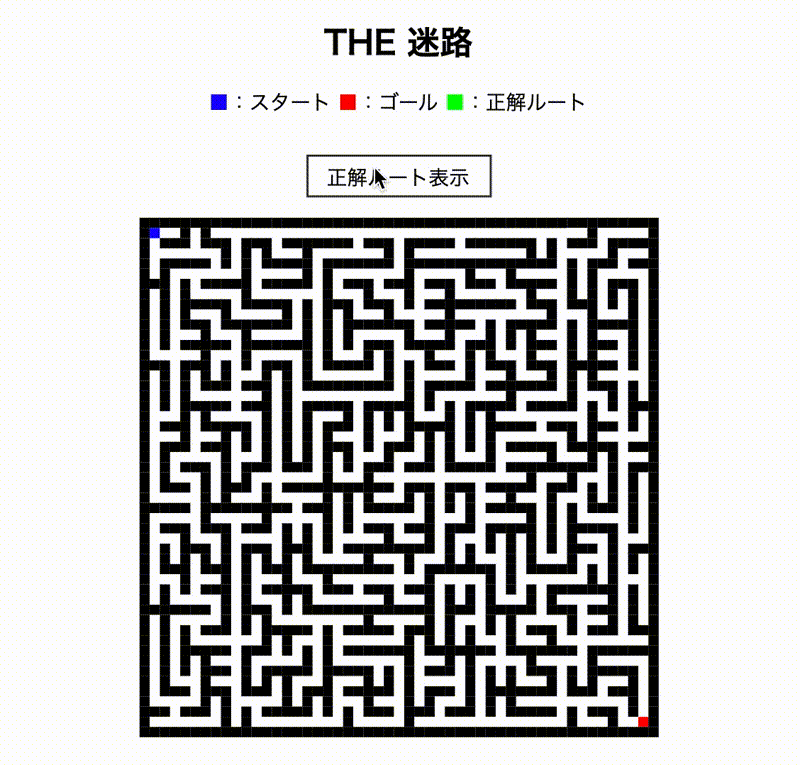
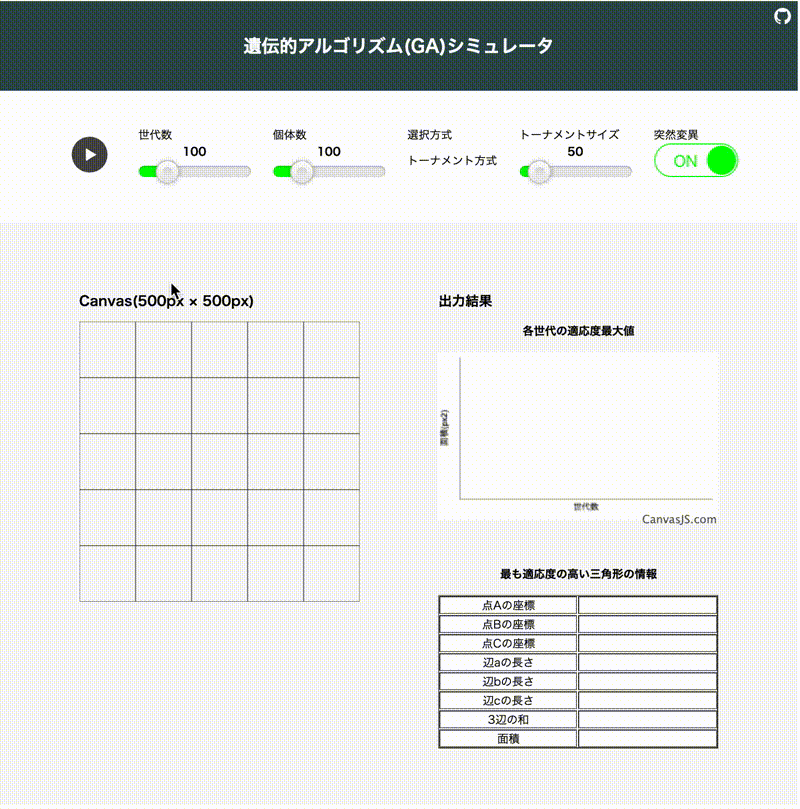
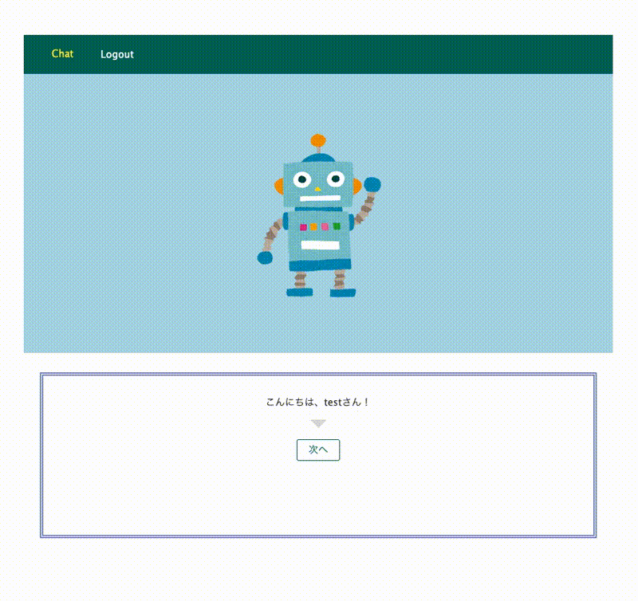

# 松本 隼人(まつもと はやと)

- [GitHub](https://github.com/Matsuhaya)
- [Facebook](https://www.facebook.com/hayato.matsumoto.3139)
- [Twitter](https://twitter.com/matsu39697760)

## 成果物

リンクは全て GitHub のレポジトリです。

### [チュートリアル： 迷路生成プログラム](https://github.com/Matsuhaya/generate-maze-tutorial)

<p align="center">

</p>

**概要**

プログラミングの理解度と、文章構成力を伝えるために自分で書いたプログラムのチュートリアルを制作しました。
迷路の自動生成プログラムを選んだ理由は、クラス構文で再帰的なプログラムを書いて、その解説をしてみたかったからです。

**関連技術**

`JavaScript`

<hr>

### [遺伝的アルゴリズム(GA)シミュレータ](https://github.com/Matsuhaya/ga-triangle)

<p align="center">

</p>

**概要**

遺伝的アルゴリズム(GA)を利用した最適解探索プログラムです。
GA を体感できるシンプルなシミュレータを制作しました。
最適化問題を設定して、それを解くにはどのようにパラメータを設定すれば良いかを体感できます。

```
問題：キャンバス内に収まるような最大面積の三角形を描画せよ

最適解：キャンバスの大きさは幅 500px、高さ 500px としたため、最大面積は下記の通り 125000px となる。
```


パラメータを調整しながら交差や突然変異などの操作を実施することで、各操作が解の探索にどのような影響を及ぼすのかを体感することを目的としています。

**関連技術**

`JavaScript`

<hr>

### [チャットボット](https://github.com/Matsuhaya/custom-bot)

<p align="center">

</p>

**概要**

約半年間のチーム開発における成果物の公開できる一部分です。

**自分の役割**

- プロダクトの API 仕様設計(Swagger)
- プロダクトの技術選定(JavaScript, Node.js, MongoDB, Heroku)
- Bot 機能の設計と実装

**こだわった点**

- Bot が、一問一答ではなくシナリオベースの応答をするよう設計
- シナリオは csv で編集し、ノンプログラミングで自由にシナリオのカスタマイズが可能
- 応答ロジックを実装したため、Bot のリアクションや挙動についてもノンプログラミングのカスタマイズが可能
- JSON 形式のシンプルなデータ構造設計

**関連技術**

`JavaScript/Node.js/Express/Mongoose/MongoDB/Swagger/Heroku/GitHub/Trello/Slack`

## プロフィール

```
大学の専攻は工学で、造船の設計・生産支援システムに関する研究テーマに取り組んだ。
プログラミングを始めたのは、大学時代に研究のツールとして利用したことがきっかけ。
継続的にプログラミングをするようになったのは、2019年3月から。

大学卒業後は大手機械メーカーに就職。（2015年4月 - 2019年2月）
エンジニアとして、国内外の営業サポートや関連部門との調整業務を担当した。
主な業務内容は次の通り。
  - エンジニアとして、顧客に対する製品プレゼン、及び仕様打合せ（海外営業サポート）
  - 顧客要求仕様の確認、納入製品仕様決定、及び関係部門に対する仕様連絡
  - 関係部門に対しての顧客要求、プロジェクトの課題、及び解決策案の連絡と提案

2019年2月に、ソフトウェアエンジニアになるために退職
2019年4月-10月の期間
  エンジニア養成学校『ジーズアカデミーTOKYO』のフルタイムコースを受講した。
2019年8月-2020年2月の期間
  知り合いの起業の手伝いという形で、チームでのプロダクト開発や調整業務を担当した。
```

## 学習記録

長いので、別リンクに掲載

[2019 年 2 月に退職してから 1 年間の学習記録](https://hackmd.io/@-2VhdOwCQGeZrRmdP1g8aQ/rJairjQVI)
